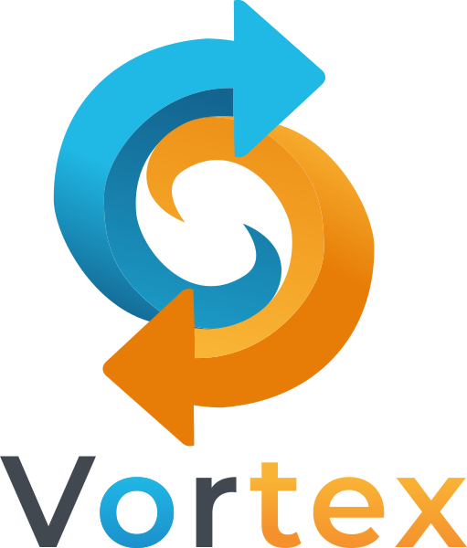

<div align="center">
  
</div>

# GoFlow

A modern front-end web framework for Go that compiles to WebAssembly, bringing the power and simplicity of Go to web development.

## ✨ Features

- **🚀 Go-Native**: Write frontend applications in pure Go
- **⚡ WebAssembly**: Compile to efficient WebAssembly for browser execution
- **🧩 Component-Based**: Build UIs with reusable, composable components
- **🎯 Virtual DOM**: Efficient rendering with virtual DOM diffing
- **🛠️ CLI Tools**: Easy project initialization and development workflow
- **📦 Core Components**: Built-in UI components (Button, Input, List, etc.)
- **🎨 Flexible Styling**: CSS class and inline style support
- **✨ Particle System**: Advanced particle effects with physics simulation
- **🎭 Animation Engine**: Powerful timeline-based animations with easing functions
- **🎪 Interactive Effects**: Mouse-responsive particle bursts and morphing animations

## 🚀 Quick Start

### Installation

Install the GoFlow CLI:

```bash
go install github.com/AureClai/goflow@latest
```

Make sure `$GOPATH/bin` is in your PATH:

```bash
# Add to your shell profile (.bashrc, .zshrc, etc.)
export PATH=$PATH:$(go env GOPATH)/bin
```

### Create Your First Project

```bash
# Create a new GoFlow project
goflow init my-app
cd my-app

# Build the WebAssembly module
goflow build

# Start the development server
goflow dev
```

Open http://localhost:8080 in your browser to see your app!

## 📖 Usage

### Basic Example

```go
//go:build js && wasm

package main

import (
    "github.com/AureClai/goflow/component"
    "github.com/AureClai/goflow/renderer"
)

func main() {
    // Create renderer
    r := renderer.NewRenderer("app")

    // Create components
    app := component.NewContainer().SetClass("app")

    title := component.NewHeading("Welcome to GoFlow!", 1)
    button := component.NewButton("Click me!", func() {
        println("Button clicked!")
    })

    app.AddChild(title)
    app.AddChild(button)

    // Render the app
    r.Render(app.Render())

    // Keep the program running
    <-make(chan bool)
}
```

### Available Components

#### Button

```go
button := component.NewButton("Click me!", func() {
    // Handle click
}).SetClass("my-button").SetDisabled(false)
```

#### Input

```go
input := component.NewInput("Enter text...").
    SetType("text").
    OnChangeHandler(func(value string) {
        println("Input changed:", value)
    })
```

#### Text Components

```go
// Headings
heading := component.NewHeading("Title", 1) // h1-h6

// Paragraph
paragraph := component.NewParagraph("Some text content")

// Generic text
text := component.NewText("Inline text")
```

#### Container

```go
container := component.NewContainer().
    SetClass("my-container").
    SetID("main")

container.AddChild(someComponent)
```

#### List

```go
items := []string{"Apple", "Banana", "Cherry"}
list := component.NewList(items).
    OnItemClickHandler(func(index int, item string) {
        println("Clicked:", item)
    })
```

### Particle System & Animations

GoFlow includes a powerful particle system and animation engine for creating stunning visual effects:

#### Particle Effects

```go
import "github.com/AureClai/goflow/animation"

// Create animation engine
engine := animation.NewAnimationEngine(renderer)
engine.Start()

// Create particle system
particles := animation.NewParticleSystem(engine)

// Create particle burst on click
config := animation.FireworkConfig() // or SparkleConfig(), MagicConfig()
particles.CreateParticleBurst(x, y, config)

// Set up global click effects
particles.SetupMouseClickHandler(config)
```

#### Advanced Animations

```go
// Create timeline animations
timeline := animation.NewTimeline(engine)

// Morphing text animation
anim := animation.NewAnimation().
    SetElement(element).
    SetDuration(800 * time.Millisecond).
    SetEasing(animation.EaseOutBack).
    Animate("transform", "scale(0)", "scale(1)", "").
    Animate("opacity", 0.0, 1.0, "").
    Build()

timeline.AddAnimation(0, anim)
timeline.Play()

// Pre-built effects
shake := animation.Shake(engine, element, 10.0, 500*time.Millisecond)
bounce := animation.Bounce(engine, element, 20.0, 1000*time.Millisecond)
```

#### Interactive Components

```go
import "goflow-website/components/effects"

// GitHub morphing button (text transforms to logo on hover)
githubButton := effects.NewGitHubMorphButton(
    "https://github.com/yourrepo",
    engine,
    particles
)

// Particle manager for coordinated effects
particleManager := effects.NewParticleManager(renderer)
particleManager.InitializeClickEffects()
particleManager.SetupAdvancedEffects() // Right-click magic, double-click sparkles
```

### Custom Components

Create your own components by implementing the `Component` interface:

```go
type MyComponent struct {
    title string
    count int
}

func NewMyComponent(title string) *MyComponent {
    return &MyComponent{title: title, count: 0}
}

func (c *MyComponent) Render() *vdom.VNode {
    return &vdom.VNode{
        Type: vdom.VNodeElement,
        Tag:  "div",
        Props: map[string]interface{}{
            "class": "my-component",
        },
        Children: []*vdom.VNode{
            {Type: vdom.VNodeText, Text: c.title},
            {Type: vdom.VNodeText, Text: fmt.Sprintf("Count: %d", c.count)},
        },
    }
}
```

## 🛠️ CLI Commands

### `goflow init <project-name>`

Creates a new GoFlow project with the basic structure:

- `main.go` - Entry point with sample component
- `index.html` - HTML template
- `go.mod` - Go module configuration
- `README.md` - Project documentation

### `goflow build`

Compiles the Go code to WebAssembly:

- Generates `app.wasm`
- Copies `wasm_exec.js` from Go installation

### `goflow dev`

Starts a local development server on port 8080 for testing your application.

## 🏗️ Architecture

GoFlow follows a component-based architecture with three main layers:

### Virtual DOM (`vdom` package)

- `VNode`: Virtual DOM node representation
- `Component`: Interface for all components
- Efficient tree structures for UI representation

### Renderer (`renderer` package)

- Converts Virtual DOM to real DOM
- Handles event binding and DOM manipulation
- Uses `syscall/js` for browser API access

### Components (`component` package)

- Pre-built UI components
- Composable and reusable
- Fluent API for easy configuration

## 🎨 Styling

GoFlow supports multiple styling approaches:

### CSS Classes

```go
component.NewButton("Styled Button", nil).SetClass("btn btn-primary")
```

### Inline Styles

```go
container := component.NewContainer().SetStyle("background: blue; padding: 20px;")
```

### External CSS

Link your CSS files in the HTML template:

```html
<link rel="stylesheet" href="styles.css" />
```

## 📚 Examples

### Basic Particle Effects

```go
// Simple click-to-burst effect
func main() {
    r := renderer.NewRenderer("app")
    engine := animation.NewAnimationEngine(r)
    engine.Start()

    particles := animation.NewParticleSystem(engine)
    config := animation.FireworkConfig()
    particles.SetupMouseClickHandler(config)

    // Your app components here...
    <-make(chan bool)
}
```

### Advanced Interactive Website

Check out the `goflow-website` directory for a comprehensive example showcasing:

- Particle bursts on mouse clicks
- GitHub button with text-to-logo morphing animation
- Multiple particle effect presets (Firework, Magic, Sparkle)
- Advanced hover effects and transitions
- Responsive design with accessibility support

## 🤝 Using as a Library

Add GoFlow as a dependency to your existing Go project:

```bash
go get github.com/AureClai/goflow
```

Then import the packages you need:

```go
import (
    "github.com/AureClai/goflow/component"
    "github.com/AureClai/goflow/renderer"
    "github.com/AureClai/goflow/vdom"
)
```

## 🔧 Development

### Prerequisites

- Go 1.22 or later
- Modern web browser with WebAssembly support

### Building from Source

```bash
git clone https://github.com/AureClai/goflow.git
cd goflow
go build -o goflow main.go
```

### Running Tests

```bash
go test ./...
```

## 🗺️ Roadmap

### Phase 1: ✅ Complete

- CLI tool for project initialization
- Basic WebAssembly compilation and serving

### Phase 2: ✅ Complete

- Virtual DOM implementation
- Component system
- Core UI components
- Event handling

### Phase 3: ✅ Complete

- **Particle System**: Physics-based particle effects with gravity, collision, and lifecycle management
- **Animation Engine**: Timeline-based animations with advanced easing functions
- **Interactive Effects**: Mouse-responsive effects, morphing animations, and visual feedback
- **Advanced Components**: Specialized components like morphing GitHub buttons

### Phase 4: 🚧 In Progress

- Client-side routing
- Navigation components
- URL management

### Phase 5: 📋 Planned

- Hot reload development server
- File watching and auto-rebuild
- Enhanced developer experience

### Future Features

#### Core Framework

- State management system
- Component lifecycle hooks
- CSS-in-Go styling
- Server-side rendering
- TypeScript definitions for JS interop

#### Performance & Benchmarking

- **Performance benchmarks vs React/JavaScript** - Comprehensive speed comparisons
- **Memory usage optimization** - WASM vs JS memory footprint analysis
- **Bundle size comparisons** - Size vs functionality metrics
- **Automated performance regression testing** - CI/CD performance monitoring
- **Real-world application benchmarks** - E-commerce, dashboards, games

#### Mind-Blowing Animation Showcases

- **DNA Helix Visualization** - Interactive 3D molecular structures
- **Galaxy Simulation** - Physics-based stellar animations with thousands of particles
- **Neural Network Visualizer** - Real-time ML model visualization
- **Fluid Dynamics Demo** - Water/smoke simulation with particle physics
- **Interactive Code Rain** - Matrix-style effects with customizable symbols
- **Morphing Geometry** - Shape-shifting animations with bezier transformations
- **Audio-reactive animations** - Music visualization and beat-responsive effects

#### Developer Experience & Debugging

- **GoFlow DevTools** - Browser extension for component inspection
- **Performance Profiler** - Real-time animation and rendering metrics
- **Memory Leak Detector** - WASM memory usage tracking
- **Animation Timeline Debugger** - Visual timeline editor and inspector
- **Hot Reload System** - Instant code changes without page refresh
- **Component Tree Visualizer** - Interactive component hierarchy explorer
- **Error Boundary System** - Graceful error handling with stack traces

#### Advanced Features

- **3D particle effects and WebGL integration** - Hardware-accelerated graphics
- **Gesture recognition and touch effects** - Mobile-first interaction patterns
- **WebRTC integration** - Real-time communication components
- **Web Workers support** - Background processing for heavy computations
- **Progressive Web App utilities** - Service worker integration and offline support

## 🤝 Contributing

We welcome contributions! Please see our contributing guidelines for details.

1. Fork the repository
2. Create a feature branch
3. Make your changes
4. Add tests if applicable
5. Submit a pull request

## 📄 License

This project is licensed under the MIT License - see the LICENSE file for details.

## 🙏 Acknowledgments

- The Go team for excellent WebAssembly support
- The Cobra library for CLI functionality
- The broader Go community for inspiration and feedback

## 📞 Support

- 📖 Documentation: [GitHub Wiki](https://github.com/AureClai/goflow/wiki)
- 🐛 Issues: [GitHub Issues](https://github.com/AureClai/goflow/issues)
- 💬 Discussions: [GitHub Discussions](https://github.com/AureClai/goflow/discussions)

---

**Happy coding with GoFlow! 🚀**
